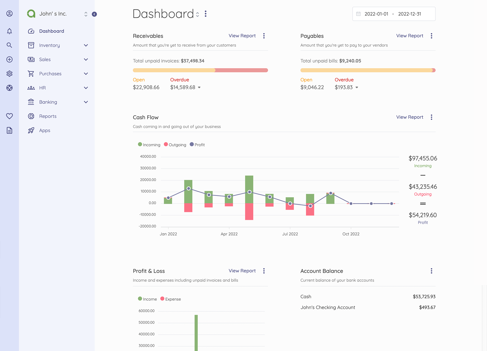

# Akaunting CI/CD pipeline

Deploy Akaunting server with CI/CD on Elestio

 
 

# Once deployed ...

You can open Akaunting UI here:

    URL: https://[CI_CD_DOMAIN]
    login: [ADMIN_EMAIL]
    password: [ADMIN_PASSWORD]

You can open phpMyAdmin UI here:

    URL: https://[CI_CD_DOMAIN]:36568
    login: root
    password: [ADMIN_PASSWORD]

# API Key

To use Akaunting, you'll need an API key. Follow these steps to obtain your API key:

1. Log in to your Akaunting Account:

   - If you don't have an Akaunting account, you'll need to create one. Visit <a target="_blank" href="https://akaunting.com/register">Akaunting</a> to sign up.

2. Retrieve Your API Key:

   - Once logged in, navigate to the <a target="_blank" href="https://akaunting.com/dashboard">dashboard</a>.
   - Locate and copy your API key from the dashboard.
